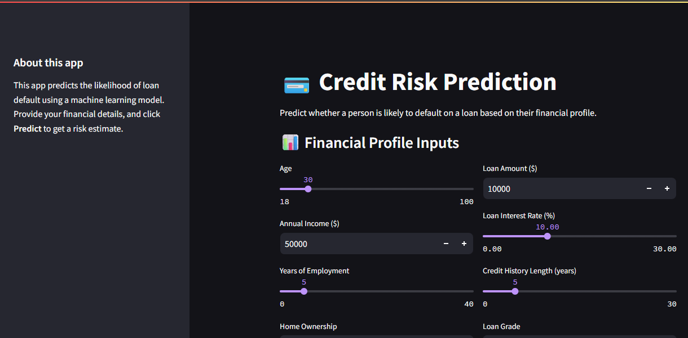
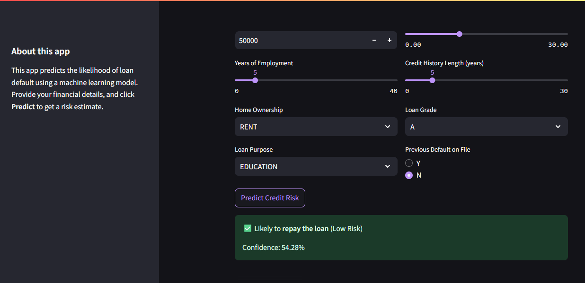

# Credit Risk Modeling

# 🧠 Overview:
Predict whether a customer poses a credit risk using classification models.
Includes a web app built in Streamlit and deployed using Docker.
  

# 🗂️ Contents:
Dataset 

EDA & Model training (notebooks/)

Models (/models)

Web interface (app/app.py)

Dockerized deployment (Dockerfile)

# 🧪 Tools Used:
Python (Pandas, Scikit-learn, XGBoost,Seaborn)
Streamlit
Docker
Jupyter Notebook

📊 Model:
Trained on laotse/credit-risk-dataset
Models evaluated: XGBoost, Random Forest
Best model: XGBoost — 91% AUC on test set

# 🚀 How to Run the App
You can run this Streamlit web app either directly on your machine or using Docker.

# Option 1: Run Locally (No Docker)🔧.
  
**Clone the repository:**  
git clone https://github.com/PenielJegede/Credit-Risk-Prediction.git  

cd credit-risk-analysis  

**Install dependencies:**  
pip install -r requirements.txt
Run the app:
streamlit run app/app.py

Open your browser:
Visit http://localhost:8501 to interact with the app.

      
# Option 2: Run with Docker🐳  

**Clone the repository:**  
git clone https://github.com/PenielJegede/Credit-Risk-Prediction.git
cd Credit-Risk-Prediction  
  
**Build the Docker image:**  
docker build -t Credit-Risk-Prediction  .
  
**Run the container:**  
docker run -p 8501:8501 Credit-Risk-Prediction  

**Open your browser:**  
Go to http://localhost:8501

# 📝 Business Insights
Creditworthy customers often have higher income, lower debt-to-income ratios, and stronger repayment history.

Model outputs can be used to:

Pre-approve customers

Adjust interest rates

Flag high-risk applications for manual review

Risk segments could be used for pre-approval, dynamic interest rate offers, or flagging for manual review.

#📬 Contact:
Include LinkedIn or Portfolio links.
