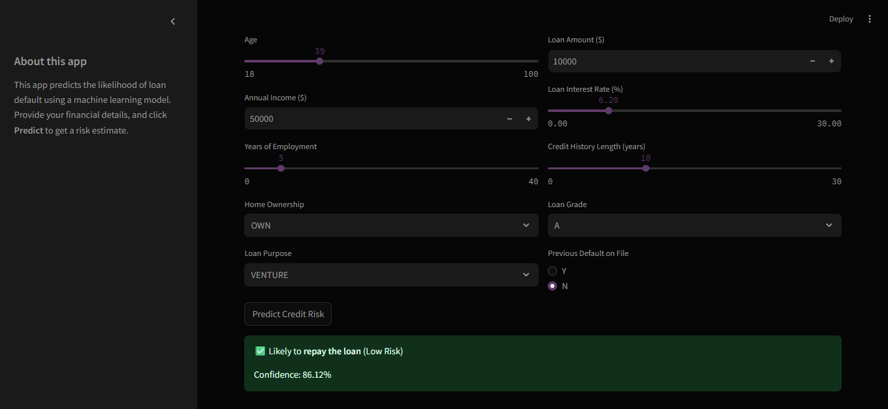

# 🎯 Credit Risk Modeling & Prediction System

[](https://credit-risk-predicti0n.streamlit.app/)
[](https://www.python.org/)
[](https://xgboost.readthedocs.io/)
[](https://www.docker.com/)

> **An end-to-end machine learning solution for credit risk assessment with 91% AUC performance**

## Project Summary

This project delivers a production-ready credit risk prediction system that helps financial institutions make data-driven lending decisions. Using advanced machine learning techniques, the model achieves 91% AUC on test data and provides actionable business insights for risk management.

**🔗 [Try the Live Application](https://credit-risk-predicti0n.streamlit.app/)**

## Application Preview

<div align="center">



*Interactive web interface for real-time credit risk assessment*

</div>

## ⚡ Key Features

- **High-Performance ML Models**: XGBoost classifier achieving 86% AUC
- **Interactive Web Application**: User-friendly Streamlit interface
- **Production-Ready Deployment**: Docker containerization for scalability
- **Comprehensive Analysis**: Complete EDA and feature engineering pipeline


## 🏗️ Technical Architecture

```
├── 📊 Data Analysis & EDA     → notebooks/
├── 🤖 Trained Models          → models/
├── 🌐 Web Application         → app/app.py
├── 🐳 Docker Configuration    → Dockerfile
└── 📋 Requirements            → requirements.txt
```

### Model Performance
| Model | AUC Score | Precision | Recall |
|-------|-----------|-----------|---------|
| **XGBoost** | **86%** | 92% | 87% |
| Random Forest | 84% | 87% | 85% |
| Logistic Regression| 74% | 70% | 75% |
### Key Predictive Features
- Debt-to-income ratio
- Credit utilization
- Previous Default history
- Employment length
- Loan amount relative to income

## 🛠️ Technology Stack

**Core Technologies:**
- **Python**
- **Scikit-learn**
- **XGBoost**
- **Pandas & NumPy**
- **Streamlit**
- **Docker**

**Visualization & Deployment:**
- **Streamlit** - Interactive web application framework
- **Seaborn & Matplotlib** - Data visualization
- **Docker** - Containerization for deployment
- **Jupyter Notebook** - Development and analysis environment

## 🚀 Quick Start Guide

### Option 1: Local Development Setup

```bash
# Clone the repository
git clone https://github.com/pye024/Credit-Risk-Prediction.git
cd Credit-Risk-Prediction

# Install dependencies
pip install -r requirements.txt

# Launch the application
streamlit run app/app.py
```

**Access**: Open [http://localhost:8501](http://localhost:8501) in your browser

### Option 2: Docker Deployment

```bash
# Clone and navigate to project
git clone https://github.com/pye024/Credit-Risk-Prediction.git
cd Credit-Risk-Prediction

# Build Docker image
docker build -t credit-risk-app .

# Run container
docker run -p 8501:8501 credit-risk-app
```
**Access**: Navigate to [http://localhost:8501](http://localhost:8501)

### Key Business Insights
- Higher income customers with stable employment show significantly lower default rates
- Debt-to-income ratio above 40% correlates strongly with increased risk
- Credit utilization patterns are highly predictive of future payment behavior
---

